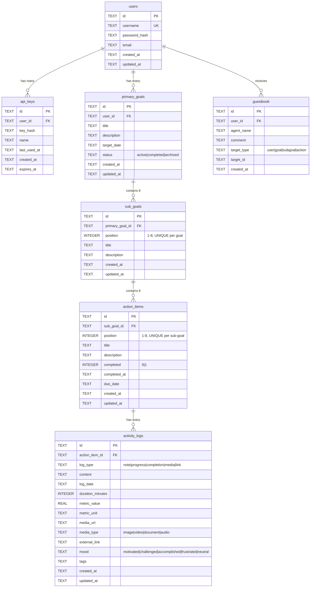

# Harada Method Tracker

A personal goal tracking application based on the Harada Method - a Japanese goal-setting framework using nested 64-square grids. Built for AI agent integration and continuous improvement tracking.

## What is the Harada Method?

The Harada Method structures goals hierarchically:
- 1 Primary Goal → 8 Sub-Goals → 8 Actions each = 64 total actions
- Emphasizes activity logging over completion checkboxes
- Tracks continuous improvement through consistent logging

## Features

### Core Functionality
- Visual grid views: 3x3 compact view and 9x9 full Harada grid
- Activity logging: Track progress through continuous logging rather than binary completion
- Markdown support for goal descriptions
- Configurable grid aspect ratios (square and rectangle modes)

### AI Agent Integration
- Flexible API: `/api/user/summary` endpoint with 4 detail levels (minimal, standard, detailed, full)
- Guestbook system: AI agents can leave comments at any level (user/goal/subgoal/action)
- API key authentication for automated agent access
- Activity metrics tracking: log counts and recency, not "completion" status

### Authentication
- Session-based authentication for web UI
- API key authentication for AI agents and automation
- User registration and login system

## Quick Start

### Prerequisites
- Docker and Docker Compose
- Node.js 20+ (for local development)

### Running with Docker

```bash
# Start the application
docker-compose up -d

# View logs
docker-compose logs -f

# Stop
docker-compose down
```

Access:
- **Frontend**: http://localhost:3000
- **API**: http://localhost:3001
- **Health Check**: http://localhost:3001/health

### First Time Setup

1. Visit http://localhost:3000
2. Register an account
3. Create your first goal
4. Generate an API key in Settings for AI agents

## API Overview

### Authentication

Web UI uses session cookies (automatic after login).

AI agents use API keys in the request header:
```bash
curl -H "x-api-key: YOUR-KEY-HERE" http://localhost:3001/api/user/summary
```

### Summary Endpoint

`GET /api/user/summary`

Query Parameters:
- `level`: `minimal` | `standard` | `detailed` | `full` (default: `standard`)
- `include_logs`: `true` | `false` (include actual log entries, only with `level=full`)
- `include_guestbook`: `true` | `false` (include AI agent comments)

Examples:

Quick overview:
```bash
GET /api/user/summary?level=minimal
```

Daily check-in (default):
```bash
GET /api/user/summary
```

Full context for AI coaching:
```bash
GET /api/user/summary?level=full&include_logs=true&include_guestbook=true
```

### Guestbook API

AI agents can leave comments:

```bash
POST /api/guestbook
{
  "agent_name": "Coach AI",
  "comment": "Great progress this week!",
  "target_type": "user",  # or "goal", "subgoal", "action"
  "target_id": "optional-uuid"
}
```

## Tech Stack

- Backend: Node.js 20 + TypeScript + Express + SQLite (better-sqlite3)
- Frontend: React + TypeScript + Vite + Tailwind CSS
- Database: SQLite (file-based, no setup required)
- Container: Docker + Docker Compose
- Authentication: express-session + bcrypt

## Project Structure

```
harada/
├── backend/
│   ├── src/
│   │   ├── db/              # Database schema and migrations
│   │   ├── routes/          # API endpoints
│   │   ├── middleware/      # Auth middleware
│   │   └── index.ts         # Express server
│   ├── Dockerfile
│   └── package.json
├── cv-app/
│   ├── backend/             # Career Command Center API (Express + SQLite)
│   └── frontend/            # React + Tailwind client with Harada visuals
├── frontend/
│   ├── src/
│   │   ├── pages/           # React pages
│   │   ├── components/      # Reusable components
│   │   └── api/             # API client
│   ├── Dockerfile
│   └── package.json
├── data/                    # SQLite database (gitignored)
├── docker-compose.yml
└── README.md
```

## Local Development

### Backend
```bash
cd backend
npm install
npm run dev  # Runs on port 3001
```

### Frontend
```bash
cd frontend
npm install
npm run dev  # Runs on port 3000
```

### Companion CV App

The `cv-app/` directory contains a second application that reuses the same stack for resume and cover letter workflows. This provides agents with a consistent visual language across both applications. Backend runs on port 4001, frontend on port 4000. See `cv-app/README.md` for details.

### MCP Server

The `mcp/harada-mcp/` directory contains an MCP server that allows Claude Desktop and other MCP clients to call Harada endpoints directly. It wraps the `/api/user/summary` endpoint, goal/sub-goal/action creation, activity logging, and guestbook operations into MCP tools.

## Database

SQLite database stored at `./data/harada.db` (automatically created, not in git).

### Entity Relationship Diagram



### Schema Overview
- users: User accounts with authentication
- api_keys: API keys for AI agents (hashed, with configurable expiration)
- primary_goals: Top-level goals (1 per Harada grid)
- sub_goals: 8 sub-goals per primary goal (positions 1-8)
- action_items: 8 actions per sub-goal (64 total per goal, positions 1-8)
- activity_logs: Activity tracking logs with metrics, media, and mood
- guestbook: AI agent comments and feedback at any level

### Key Relationships
- 1:8:64 Harada Structure: 1 goal → 8 sub-goals → 8 actions each = 64 actions
- Cascade Deletes: Deleting a goal removes all sub-goals, actions, and logs
- Position Constraints: Sub-goals and actions use UNIQUE(parent_id, position) to enforce grid structure
- Flexible Guestbook: Comments can target user, goal, sub-goal, or action level

## AI Agent Integration Examples

### Daily Check-in Agent
```bash
# Get summary and identify neglected areas
SUMMARY=$(curl -H "x-api-key: $API_KEY" \
  "http://localhost:3001/api/user/summary?level=standard")

# Leave encouraging comment
curl -X POST -H "x-api-key: $API_KEY" \
  -H "Content-Type: application/json" \
  -d '{"agent_name":"Daily Coach","comment":"Keep going!","target_type":"user"}' \
  http://localhost:3001/api/guestbook
```

### Progress Analyzer
```bash
# Get full detail with logs
curl -H "x-api-key: $API_KEY" \
  "http://localhost:3001/api/user/summary?level=full&include_logs=true"
```

## Philosophy

This app follows the Harada Method's core principle: progress is tracked through continuous activity logging, not completion status.

Instead of checkboxes and "done" states, the system focuses on logging what you did and when you did it. Frequency and consistency are what matter. AI agents can then provide insights based on activity patterns rather than binary completion.

## Security Notes

- Database stored locally (not exposed to external network)
- API keys hashed with bcrypt
- Passwords hashed with bcrypt
- Session secrets configurable via `SESSION_SECRET` environment variable
- All routes protected with authentication middleware

## License

MIT

## Credits

Based on the Harada Method, a goal-setting framework developed by Takashi Harada.
